# Cross-Architecture IoT Malware Detection Plan

Started 2026-09-20. Last updated 2026-10-07, after `chore/pr-workflow`. This file is the plan of record; the dated change log at the end records what moved and when. Numbered decisions live in `docs/decisions.md`, what the files contain in `docs/dataset_notes.md`, and each week's day-by-day record in `docs/plans/week-N.md`.

## Research question

The question this paper asks is whether a small neural network, trained on the system-call and network behaviour of malware running on three IoT processor architectures, can recognise malware on a fourth architecture it has never seen. The dataset we use, CIC-YNU-IoTMal 2026, was built by running about ten thousand real malware binaries from the IoTPOT honeypot inside emulated OpenWrt routers for four architectures (ARM, MIPS, MIPSEL and x86) and recording what each binary did. The paper that introduced the dataset evaluated each architecture on its own and named cross-architecture evaluation as future work, so the question is the one the dataset was built to make possible and has not yet been asked of it.

The claim we hope to make, if the experiments succeed, is that a model with fewer than a hundred thousand parameters, trained on syscall windows whose column names have been reconciled across architectures and on network-flow statistics that carry no trace of the sandbox, keeps most of its malware-versus-benign performance when it is tested on an architecture that was held out entirely from training, and does so without any window from a test binary ever having been seen during training. The last clause matters as much as the first, because the dataset's own baseline splits at the level of rows, and a row here is a sliding window cut from one binary's trace, so neighbouring rows from the same executable land on both sides of a random split and the reported accuracy measures memorisation rather than recognition.

Three hypotheses give the study its shape, and each is tied to one experiment. The first, which we call H1 or canonicalisation, says that mapping architecture-specific syscall names onto one shared vocabulary raises accuracy on an unseen architecture compared with using the raw per-architecture columns; the 32-bit kernels expose the same call under different names, so that `mmap2` on ARM and `mmap` on x86 are the same operation and a model given the raw columns can tell architectures apart by which columns are non-zero. The second, H2 or shortcut removal, says that dropping the two network features most likely to fingerprint the sandbox rather than the malware, the share of DNS traffic and the time-to-live field, lowers accuracy within an architecture but holds or raises it across architectures, because those features encode where the benign programs were told to send traffic rather than how malware behaves. The third, H3 or leakage, says that the row-level random split the dataset paper used overstates accuracy relative to a split that keeps every binary whole, and we report the size of that gap as a finding in its own right.

Family classification, meaning the harder task of naming which malware family a binary belongs to rather than only whether it is malicious, is a secondary experiment restricted to Benign, Mirai, DarkNexus and Gafgyt (decision D7, taken 2026-09-26). The label Generic is a catch-all that antivirus vendors assign when they cannot name a family, so it is excluded, and the families Tsunami, Agent and Rudedevil have between one and three binaries each in this dataset, so they are reported as a case study in leakage rather than as classes that could support a held-out estimate.

## What the data changed (2026-09-26, extended 2026-10-05)

The first nine repository steps (the scaffold, the manifest, the row-level verification, the fill check, the canonical vocabulary, the near-duplicate scan, the split, its conflict fix and the baselines) settled most of the questions the plan had left open. The full record lives in the repository under `docs/dataset_notes.md`, which describes what the files actually contain, and `docs/decisions.md`, which holds the numbered decisions D1 to D9 that later sections cite. The table below gives each question, what the data said, and what that does to the paper.

| Question | Answer | Effect on the paper |
| --- | --- | --- |
| Per-row hash present? | Yes, in all 12 files | Hash-grouped split (D2) is possible as planned |
| Rows contiguous per binary? | Yes, in all 12 files | The 1D-CNN stays in scope |
| Nulls or mean-fill in STRACE? | No nulls; all count columns integer-valued | D5 needs no code beyond an integer cast |
| Column differences between architectures? | 181 raw names, 130 to 135 per file | Folded to 132 canonical names by alias table and prefix rule (D6) |
| What is Unknown? | Binaries with no resolvable family; dropped from STRACE by the authors, kept in pcap and sar | Dropped everywhere; MIPSEL loses 1,376 of 5,490 binaries |
| Binaries per class? | About 9,700 benign, 7,600 Mirai, 225 DarkNexus, 69 Gafgyt, 47 Generic, 6 others | "Malware detection" here is mostly Mirai detection and the abstract says so; family experiment narrowed to four classes (D7) |
| Rows per binary? | 3 to 184,253; ARM median 18 | The evaluation unit becomes the binary, with window-level numbers as a secondary table |
| Do binaries behave identically under different hashes? | Yes, heavily: 1,687 ARM benign binaries share one trace, 190 x86 Mirai binaries share another | The split groups by exact summed syscall vector rather than by hash (D2 revised); a group is one example in the group view of every result |
| Did the ARM binaries run at all? | Mostly not: 1,830 of 1,980 benign, 1,212 of 2,795 Mirai and 50 of 91 DarkNexus have fewer than 64 calls and no network call | Inert binaries are excluded from training and scoring (D8); the ARM figures in the dataset paper largely measure samples that did not run, which the paper states as a finding |
| Do any traces carry both labels? | After inert removal, none on any architecture; the one x86 trace shared by 190 Mirai and one Generic binary agrees on the detection target | Conflict means benign against malware only; the 190 stay in |
| Does a row-level split inflate single-window scores? | Barely: on mid-trace windows the row-random split scores at most 0.5 MCC points above a split that keeps binaries whole on MIPS and x86; MIPSEL's 2.2 points and ARM's swings of up to 5 points in either direction lie between the two grouped splits, each a single draw, within the split-to-split variation D2 measured. The 400-round cap bound in 85 percent of row-random fits (`data/LEAKAGE.md`) | H3's leak is small at the baseline's capacity; the paper reports it with the capacity caveat. Whether to rerun with more rounds, or with re-dealt grouped splits per seed to measure draw noise, is open |
| Do the first calls name the class? | Yes, almost at once: after five calls every live benign binary on an architecture has one identical window and almost no malware binary shares it; from ten calls on, XGBoost on that prefix alone matches the whole trace on every in-architecture and leave-one-out fold (AUROC 1.000 on all four held-out architectures), and removing the socket-family calls from the 20-call features changes no detection fold (`data/FIRST_WINDOW.md`, `data/BASELINE.md`) | The shortcut is program start-up, not network behaviour, consistent with the benign programs sharing one C library's start-up code. Open: whether the paper's claim is the lightweight model or the benchmark critique is for the researchers to decide |

The data also raised two risks the original plan did not name. The benign class consists of roughly 9,700 C programs that the dataset's authors generated with a language model from a single prompt template, while the malware is real code captured by a honeypot, so the signal that separates the two classes may turn out to be "written by a generator from a template" rather than "malicious", and a signal of that kind would transfer across architectures for the wrong reason, because the generator is the same whatever the target chip. The second risk follows from the first: a split that keeps every binary whole closes only the exact-duplicate leak, and programs produced from one template can compile to identical syscall behaviour under different file hashes, so two copies of what is in effect the same program can still sit on opposite sides of the split. Step 6 measured both of these before the split was designed, by aggregating each binary's behaviour into one vector and counting how many distinct vectors each class actually contains, and the answer was that duplication is heavy enough that the split had to group by behaviour rather than by hash. A third finding followed from the same scan: most ARM executions never reached the program's own logic, which the data-pipeline section and D8 take up.

## Scope

The scope was fixed on 2026-09-20 and refined on 2026-09-26. The primary task is binary detection, meaning the model answers only whether a binary is malicious, and the headline claim is generalisation to an unseen architecture, established by leave-one-architecture-out evaluation, in which the model is trained on three architectures and tested on the fourth, repeated so that each architecture takes its turn as the held-out one. Two of the dataset's three behavioural recordings are in scope: STRACE, the per-window counts of Linux system calls the binary made, and PCAP, the per-window statistics of the network traffic it produced. The target is a workshop or short paper in about three months, written by two researchers on a budget of five hundred dollars of AWS credits.

The third recording, SAR, which samples CPU, memory and I/O utilisation once a second, is out of scope. Its values depend on how fast the emulator ran each architecture and how large each virtual machine was, so they carry an architecture signature that would have to be normalised against a benign baseline before any cross-architecture claim could rest on them, and the dataset paper reports SAR as the recording most sensitive to how class imbalance was handled. Three months and two people do not cover that work, and it is named as future work rather than attempted.

Three decisions were left open at the start. The row-order question was resolved on 2026-09-26: every binary's rows form one unbroken block in all four STRACE files, so a sequence model over consecutive windows stays in scope. Two remain open and are carried into the documentation step. The first is the device budget, meaning the ceiling on parameter count, quantised model size and inference latency that qualifies a model as lightweight; the working default is under 100K parameters, under 1 MB after int8 quantisation and under 10 ms per window on a single ARM Cortex-A53 core, pending the choice of ARM board to measure on. The second is the venue, a security workshop co-located with a 2027 conference or a short-paper track, which sets the page limit and therefore how many ablations fit.

## Data pipeline

The pipeline turns the twelve released parquet files into features a model can train on without leaking test binaries into training, and its order matters more than any single step. The diagram shows the order as it actually ran, which differs from the original plan in two ways: canonicalisation, the reconciliation of syscall names across architectures, happens before the split rather than after it, because the near-duplicate scan that decides how the split groups binaries needs canonical vectors to compare; and the first SageMaker Processing job, a managed container that reads from S3 and writes back to it, is the feature-store write, since everything before it fit on the notebook.

```mermaid
flowchart LR
  A[Raw parquet in S3<br/>4 arch x 3 recordings] --> B[Manifest<br/>footers only]
  B --> C[Verify<br/>hash, contiguity, classes]
  C --> D[Canonicalize STRACE<br/>181 names to 132]
  D --> E[Near-duplicate scan<br/>per-binary vectors]
  E --> F[Split by behaviour group<br/>inert set aside]
  F --> G[Baselines<br/>XGBoost, three experiments]
  G --> H[First-window scan<br/>linkage shortcut]
  H --> I[Feature store<br/>Processing job]
  I --> J[Prune PCAP<br/>DNS and TTL ablation]
```

The split is placed after canonicalisation but before any statistic is fitted, so that no vocabulary, scaler or class weight is ever computed on a test binary. Each step below names what it does and the check that shows it worked; the first seven are done and their outputs are committed in the repository's `data/` directory.

| Step | What it does | Check that it worked | Status |
| --- | --- | --- | --- |
| Manifest | Reads the footer of every parquet file (row count, column count, row groups) and compares row counts with the authors' own per-family counts | Every STRACE file matches the paper exactly; the difference in pcap and sar is the Unknown rows | Done |
| Verify | Reads every row's label and hash, one row group at a time, to count classes, count distinct binaries per class, and test that each binary's rows are contiguous | Hash present on every row; contiguous in all twelve files; class counts reproduce the authors' CSV | Done |
| Fill check | Samples the `double` count columns for non-integer values, which would be the fingerprint of the authors' mean-fill applied before release | No non-integer values anywhere, so D5 needs no code | Done |
| Canonicalize | Folds 181 raw syscall names onto 132 canonical ones by an alias table and a unique-prefix rule for truncated names; zero where a call never occurs | Every architecture yields the same 132 columns; the per-column outcome is in `data/syscall_resolution.csv` | Done |
| Near-duplicate scan | Sums each binary's canonical counts into one vector and counts distinct vectors per class under three signatures of decreasing strictness; the per-binary table it writes is the feature store the baselines train on | `data/DEDUP.md`: 1,687 ARM benign binaries share one trace, 190 x86 Mirai share another | Done |
| Split | Sets aside inert binaries (fewer than 64 calls, no network call; D8), then assigns every behaviour group, meaning all binaries of one architecture with one exact syscall vector, to train, validation or test (70/10/20) per architecture and family, a group that spans two malware families being dealt once under the larger, each family with its own seed; a group that holds both benign and malicious binaries is a conflict and is scored by nobody | `data/SPLIT.md` and `data/splits/`: zero overlap of groups and hashes within an architecture, asserted by a test; no conflict remains after inert removal | Done |
| Baselines | One XGBoost model on the per-binary feature store under three experiments: in-architecture on the split columns, leave-one-architecture-out on the whole held-out architecture, and an architecture-sanity classifier that predicts the architecture from the same features (D9) | `data/BASELINE.md`: metrics per fold in a per-binary view and a per-group view, with the test set's majority share printed as chance | Done |
| First window | Keeps each binary's row N for N of 5, 10, 15 and 20 (its first N calls; the whole trace when shorter) in a second scan and trains on each alone, and on 20 without the network calls, to measure whether the loader prologue already names the class (the linkage shortcut D8 raised) | `data/BASELINE.md`: first-window metrics beside whole-trace metrics on the same binaries; `data/FIRST_WINDOW.md`: first windows shared by benign and malware | Done |
| Feature store | Writes canonicalised, split-labelled window tables to S3, one file per architecture and split, as a Processing job | Row counts per split reconcile with the verification report | Week 3 |
| Prune PCAP | Keeps the 39 flow statistics, which carry no address, port or hostname, and runs the model with and without `DNS` and `Time_To_Live` as the H2 ablation | Accuracy with and without the two columns, in and across architectures | Week 4 |

One fact about the STRACE tables shapes the model design. There is one row per system call, and each row counts every system call over the most recent twenty calls (over the calls so far, for a binary's first nineteen rows), so a row is already an aggregate rather than a raw call and a binary with `w` rows made `w` calls, and there is no timestamp or window index in the file; row order within a binary is the only carrier of sequence. Because the verification showed that order is preserved, consecutive rows of one binary can be treated as a sequence and fed to a one-dimensional convolutional network, which slides a small filter along the sequence to detect patterns in how call counts change over time. Had the order been scrambled, only bag-of-window models, which treat each row independently, would have been possible.

## Models

The gradient-boosted tree ensemble is the bar every neural network has to clear, and the network's contribution is its size and its transfer to an unseen architecture rather than raw accuracy on the architectures it was trained on. Gradient boosting, in the XGBoost implementation, builds a few hundred small decision trees one after another, each correcting the errors of the ones before, and on tabular data of this kind it usually beats a small network outright; the dataset paper's own best results came from tree ensembles. If XGBoost on the canonical features already transfers well, the paper becomes a comparison of parameter count and latency at equal accuracy, which is still a result worth publishing, because a tree ensemble of several hundred trees is not something that runs comfortably on a router. The table gives each model, its input, its approximate size and the reason it is in the study.

| Model | Input | Approx. size | Why it is in the study |
| --- | --- | --- | --- |
| XGBoost | Canonical STRACE counts + pruned PCAP | 200 to 500 trees | Strongest tabular baseline; the paper's own best models were tree ensembles |
| MLP-small | Same as XGBoost, one 256-unit and one 64-unit hidden layer | ~120K params, ~30K after pruning | Direct like-for-like NN on the released features |
| MLP-groups | Semantic-group vector (8 to 12 dims) + pruned PCAP | under 5K params | Tests whether the coarse mapping alone carries the transfer |
| 1D-CNN | Sequence of 32 consecutive canonical windows per binary | ~50K params | Sequence model; runs only if row order per hash is confirmed |
| Late fusion | STRACE model logit + PCAP model logit, one linear layer | adds under 100 params | Cheapest way to combine modalities without a joint model |

A few training choices hold for every network so that differences between them come from architecture rather than procedure. Class imbalance is handled by weighting the loss, meaning errors on the rarer class count for more during training, rather than by SMOTE, which manufactures synthetic minority examples by interpolating between real ones; the dataset paper found weighting the more robust of the two on STRACE, and because rows per binary vary by four orders of magnitude the weights are computed over binaries rather than rows. Optimisation uses AdamW, early stopping watches the validation split of the source architectures only, every configuration is run with five random seeds so that the reported number is a mean with a standard deviation, and the size and latency figures come from the model after post-training quantisation to eight-bit integers with ONNX Runtime, which is the form a model would ship in.

Latency is measured on a Raspberry Pi 4 or the closest ARM board available in the lab rather than on the AWS instance, because the deployment claim is about the device, and a number measured on a server GPU would say nothing about it.

## Evaluation protocol

Every number in the paper comes from leave-one-architecture-out evaluation on splits that keep each behaviour group whole: the model is trained on the `train` binaries of three architectures, stops early on their `val` binaries, and is scored on every live binary of the fourth architecture, and this is repeated four times so that each architecture is the held-out one once. Scoring the whole held-out architecture rather than its `test` column is what makes the ARM fold usable, since ARM has only 150 live benign binaries in total after the inert ones are removed. Numbers measured within a single architecture appear only as a reference column, because they are the numbers the dataset paper already reports and they are not the claim. A binary labelled `test` is unseen in every experiment, so the in-architecture and cross-architecture numbers for one architecture are scored on overlapping populations and the gap between them is a result rather than an artefact of different test sets (D9).

The evaluation unit is the binary (revised 2026-09-26). A model that scores windows gives a binary the mean of its window scores, a model on the per-binary feature store scores the binary directly, and metrics are computed over binaries. Rows per binary range from 3 to 184,253, so a window-level metric would weight one long-running Mirai sample thousands of times more than a short one, and no deployment decides per window. Window-level numbers appear in a secondary table for comparability with the dataset paper. Every detection result is also reported in a group view (added 2026-10-05), in which the binaries that share one exact syscall vector count as a single example with their mean score, because 190 identical x86 Mirai builds would otherwise count 190 times in one test set. The group view answers how many distinct behaviours the model gets right.

Metrics are MCC and macro-F1 as primary, with accuracy, AUROC and the test set's majority share (chance) reported alongside. MCC, macro-F1 and accuracy are taken at the decision threshold that maximises MCC on the fold's validation binaries, which never include the held-out architecture, and MCC at 0.5 and the chosen threshold are reported beside them (revised 2026-10-05, D9). Because scores can shift on an unseen architecture while the ranking holds, AUROC is read beside MCC on every held-out fold. MCC is chosen because the classes are imbalanced in both directions (benign is about 55 percent of binaries and 20 percent of rows, and the ARM held-out fold is about 92 percent malware once inert binaries are gone). Each neural-network number is the mean and standard deviation over five seeds; the tree baseline runs once with a fixed seed.

The experiments run in a fixed order, because each one validates something the next depends on. The table lists them with what each is expected to show.

| Order | Experiment | What it establishes |
| --- | --- | --- |
| 0 | Reference baselines (done): XGBoost in-architecture, leave-one-architecture-out and architecture-sanity on the per-binary feature store | The bar every network has to clear; how much architecture signal the canonical vocabulary leaves behind |
| 0b | First-window check (done): the same baselines trained on each binary's first 5, 10, 15 and 20 calls only, and on 20 without the network calls | Whether the dynamic-loader prologue separates generated benign programs from statically linked malware before any behaviour is seen |
| 1 | Leakage check (H3, done): XGBoost on sampled single windows under row-random, hash-grouped and behaviour-grouped splits, per architecture, five seeds (D10) | The size of the gap |
| 2 | Baseline transfer: XGBoost leave-one-architecture-out on raw columns against canonical columns (H1) | Whether reconciling names helps, and by how much |
| 3 | Shortcut check (H2): PCAP models with and without `DNS` and `Time_To_Live`, within and across architectures | Whether the two features fingerprint the sandbox |
| 4 | Network transfer: MLP-small, MLP-groups and the 1D-CNN under the same protocol, then late fusion | Whether a small network reaches the tree baseline on an unseen architecture |
| 5 | Size and latency: parameter count, int8 size and per-window inference time on the ARM board, for every model within five MCC points of XGBoost | The deployment claim |
| 6 | Family classification on the four D7 classes, only if the five above finish by week 9 | The secondary result |

The study counts as a positive result if at least one network under the size budget lands within five MCC points of XGBoost on the held-out architecture on all four folds. A negative result on the network side is still a paper, provided the leakage and shortcut findings from experiments 1 and 3 are clean, because those two correct the published baseline whatever the networks do.

## AWS setup and budget (SageMaker AI)

Compute runs as SageMaker AI jobs with managed spot training rather than on a long-lived virtual machine (revised 2026-09-22). A SageMaker job is a container that starts, runs one script against data in S3, writes its results back, and stops, so it bills only while the script runs and there is no idle instance to forget about; managed spot means the job runs on spare capacity that AWS sells at a discount and can reclaim, with the job's progress checkpointed to S3 so a reclaimed instance costs a resumption rather than a restart. SageMaker's instances list at roughly a quarter to two fifths more than the same hardware rented as plain EC2, and spot typically returns most of that premium, so the net cost lands a little below plain on-demand pricing. The study fits in roughly $150 to $260 of the $500, leaving about half the credits for reruns after review. The table gives each planned use with the instance, its approximate price and the estimated total.

| Item | SageMaker resource | Approx. price (us-east-1) | Planned use | Estimated cost |
| --- | --- | --- | --- | --- |
| Preprocessing | Processing job, ml.r5.2xlarge (8 vCPU, 64 GiB) | about $0.71/h on-demand; processing jobs have no spot option | 60 h across weeks 2 to 4 | $42 |
| XGBoost baselines | Training job, ml.m5.2xlarge, managed spot | about $0.54/h on-demand, roughly $0.20/h effective on spot | 40 h | $8 to $22 |
| MLP training | Training job, ml.m5.2xlarge, managed spot | same | 40 h; the MLPs are small enough for CPU | $8 to $22 |
| 1D-CNN training | Training job, ml.g5.xlarge (1 A10G), managed spot | about $1.41/h on-demand, roughly $0.45 to $0.60/h effective on spot | 60 h | $30 to $85 |
| Notebook | Studio JupyterLab space, ml.t3.medium, idle shutdown at 60 min | $0.05/h; 250 h free in the first 2 months of SageMaker use if the account qualifies | 100 h | $0 to $5 |
| Storage | S3 standard | about $0.023/GB-month | 100 GB for 4 months | $10 |
| Buffer |  |  | reruns, on-demand fallback if spot capacity is unavailable | $200 |

Prices are approximate list prices as of 2026-09-22 from [SageMaker AI pricing](https://aws.amazon.com/sagemaker/ai/pricing/) and third-party trackers ([ml.g5.2xlarge at $1.52/h](https://calculator.holori.com/aws/sagemaker/ml.g5.2xlarge) is the nearest published G5 figure); confirm ml.g5.xlarge and ml.r5.2xlarge in the console before week 2. Spot effective rates vary by hour and by region.

The guardrails were put in place in week 1 before any data landed. AWS Budgets sends alerts to both researchers at $100, $250 and $400 of spend. Each researcher has an IAM user with multi-factor authentication, and one SageMaker execution role, the identity a job or notebook assumes when it touches AWS services, is scoped to the project bucket. The Studio JupyterLab space, which is the one resource that can bill while nobody is working, shuts itself down after sixty minutes idle. Every job carries the tag `project=iotmal` so that Cost Explorer can be filtered to the project at the weekly sync, the bucket expires its `scratch/` and `checkpoints/` prefixes after thirty days, and all code lives in a private GitHub repository from which jobs pull at start, so nothing exists only on a notebook.

Job design that keeps SageMaker cheap: one training job runs an entire sweep (all four leave-one-out folds times five seeds) from a config file, because each job pays 3 to 6 minutes of container startup and a single MLP fold trains in under that. Managed spot is enabled with `use_spot_instances=True`, `max_run` set to the sweep's expected time, `max_wait` at least twice that, and `checkpoint_s3_uri` pointing at `checkpoints/`; the script writes a checkpoint and a results CSV row to `/opt/ml/checkpoints` after every fold so an interruption resumes at the next fold. Metrics go to the results sheet from the job's output, not copied by hand.

The raw data was downloaded from CIC by hand and uploaded to the bucket under `raw/Yokohama/`, with the ARM archive extracted to sit beside the other three architectures. Every scan in week 1 read that data directly from S3 on the notebook through pyarrow's own S3 support, which fetches only the parts of a parquet file it needs, so no job and no local copy was required for any of the first six steps.

## Timeline and division of labor

Twelve weeks from 2026-09-22 to a submission-ready draft by 2026-12-14. Revised 2026-09-28: the Researcher A and B tracks are gone. All code and reasoning flow through one thread, land in the repository as one patch per step (D1), and both researchers review every write-up; the table is now by step rather than by person. Week 1 finished six steps against a plan of two, so weeks 2 to 4 absorb the slack as extra ablations rather than moving the draft date.

| Week | Dates | Steps | Milestone |
| --- | --- | --- | --- |
| 1 | Sep 22 to 28 | Done: scaffold, manifest, verification, fill check, canonical vocabulary, near-duplicate scan | Data understood; D1 to D7 written |
| 2 | Sep 29 to Oct 5 | Done: `feat/split` by behaviour group with inert binaries set aside, `fix/split-conflict`, `feat/baseline` with the three experiments and the sanity classifier, `docs/plans` (this file moved into the repository). Carried: week-1 closeout docs (device budget, venue, syscall groups, leakage spec) | Split files committed; D8 and D9 written; baseline code merged |
| 3 | Oct 6 to 12 | Run the baselines and commit `data/BASELINE.md`; `fix/trace-length`; `feat/first-window`; week-1 closeout docs; leakage experiment (H3): row-level versus grouped splits, XGBoost, per architecture; first Processing job writes the window-level feature store | Corrected baseline table; sanity score known |
| 4 | Oct 13 to 19 | XGBoost leave-one-architecture-out on raw versus canonical columns (H1); PCAP `DNS` and `TTL` ablations (H2); binary-level and window-level metrics side by side | Baseline transfer table complete |
| 5 | Oct 20 to 26 | Training harness (SageMaker managed spot, sweep per job, checkpoints); MLP-small and MLP-groups | First NN transfer numbers |
| 6 | Oct 27 to Nov 2 | 1D-CNN over consecutive windows; late fusion of STRACE and PCAP | All four folds for every model |
| 7 | Nov 3 to 9 | int8 quantization with ONNX Runtime; latency on the ARM board; five-seed reruns | Size and latency table |
| 8 | Nov 10 to 16 | Figures; family experiment on the four D7 classes; rare-family case study | Results frozen |
| 9 | Nov 17 to 23 | Draft: data, pipeline, setup, results | Full first draft |
| 10 | Nov 24 to 30 | Related work, introduction, limitations; each researcher reviews the other's sections | Second draft |
| 11 | Dec 1 to 7 | Reproducibility package: repo, split files, mapping tables, run scripts | Artifact ready |
| 12 | Dec 8 to 14 | Final read; every number checked against logs; venue template | Submission-ready |

Weekly 30-minute sync, same day each week, with the results sheet updated before the call. Anything that slips two weeks moves the family experiment and the 1D-CNN out of scope first, in that order.

## Risks

The two risks that could have changed the paper's shape, a missing per-row hash and scrambled row order, were both resolved in the first week by the verification scan, which is why the timeline front-loaded that work. The table holds the original register with each risk's likelihood, effect and mitigation, and the paragraph after it records the three risks that the data itself raised.

| Risk | Likelihood | Effect | Mitigation |
| --- | --- | --- | --- |
| Released parquet lacks a per-row hash or row order per binary | Medium | No hash-grouped split; no sequence model | Check in week 1. Fallback: rerun a subset of binaries through the public CIC-YNU-IoTMal-Sandbox to regenerate traces with hashes; budget 20 h of r6i time |
| Canonical features still separate architectures strongly | Medium | Transfer numbers stay low | Add the semantic-group representation and per-architecture standardization; report the sanity classifier score so the reader sees how much architecture signal remains |
| Benign class is too easy after pruning PCAP endpoints | High for PCAP alone | Inflated results | Report PCAP-only, STRACE-only, and fused separately; state the benign-generation caveat in limitations |
| Rare families (Tsunami, Agent, Rudedevil) too small for any family result | High | Family experiment drops | Already secondary; report binary only if needed |
| Credits run out | Low | Reruns blocked | Budget alarms; the $200 buffer; all training is minutes per run |
| Spot interruptions during training | Medium | Lost time | Per-epoch checkpoints to S3; on-demand fallback for final five-seed runs |
| One researcher loses availability for two or more weeks | Medium | Timeline slips | Family classification and the 1D-CNN are cut first; the leakage and shortcut findings alone still make a short paper |

Four risks were added once the binary counts were known, three on 2026-09-26 and one on 2026-10-01. The first, near-duplicate benign binaries, is likely: the benign programs come from one prompt template and may compile to identical syscall behaviour under different hashes, so a split that keeps binaries whole can still place two copies of the same behaviour on opposite sides; step 6 counts distinct per-binary feature vectors per class, and if that count is far below the binary count the split groups by behaviour signature instead. The second, a template signal in place of a malice signal, is possible: because the benign class is generated and the malware is real, a model may learn the generator's fingerprint, which would transfer across architectures for the wrong reason; the mitigation is to report which features carry the decision, to run the DNS and time-to-live ablations on the network features, and to state the limitation plainly, with a benign set drawn from real firmware named as future work rather than attempted. The third has already happened: only Benign, Mirai, DarkNexus and Gafgyt have ten or more binaries on any architecture, so the family experiment is narrowed to those four by D7. The fourth, found by the split step, is that the ARM sandbox mostly produced inert executions: about 65 percent of ARM samples, and 1,830 of its 1,980 benign binaries, never reached their own logic. Excluding them (D8) leaves ARM with 150 live benign binaries, so the ARM held-out fold is scored on the whole architecture rather than a test column (D9), and the inert benign trace being a dynamic loader while the inert Mirai trace has none raises the possibility that the first twenty calls of any trace already name the class; the first-window experiment measures that.

## Deliverables

Four deliverables are due by 2026-12-14. The first is the paper draft itself. The second is a public repository holding the split files and the canonical syscall mapping, so that anyone can reproduce the leave-one-architecture-out protocol on the same binaries with the same vocabulary. The third is the set of trained models in their quantised form. The fourth is a results sheet in which every run is logged by seed, so that every number in the paper can be traced to the run that produced it.

Week 1 closeout (2026-09-28): `docs/plans/week-1.md` holds the record. Done: guardrails, bucket and data, manifest, row-level verification, canonical mapping with review of its four judgment folds, repository with `make check`, results-sheet columns agreed. Carried forward as one documentation step: device budget and ARM board, venue with page limit and deadline, `configs/syscall_groups.yaml`, `docs/experiment_h3_leakage.md`.

Sources: [CIC-YNU-IoTMal dataset page](https://www.unb.ca/cic/datasets/ynu-iot-2026.html), [Dadkhah et al., Information Systems 140 (2026) 102722](https://doi.org/10.1016/j.is.2026.102722), [CIC-YNU-IoTMal-Sandbox](https://github.com/UNBCIC/CIC-YNU-IoTMal-Sandbox), [g5.xlarge pricing](https://instances.vantage.sh/aws/ec2/g5.xlarge), [r6i.2xlarge pricing](https://instances.vantage.sh/aws/ec2/r6i.2xlarge).

## Change log

| Date | Change |
| --- | --- |
| 2026-10-07 | `chore/pr-workflow`: pushing waits for a researcher's yes, pull requests open with `gh`, and squash-merge with branch deletion waits for a second yes (D1 revised); CLAUDE.md also says hour-long runs go to managed-spot jobs that checkpoint to the bucket (D4) |
| 2026-10-05 | `feat/leakage`: H3 implemented and run as D10 specifies (sample scan, three splits, five seeds, three views); row-level leakage is under one MCC point on MIPS and x86 at the baseline's capacity; data-findings row added; spec marked decided and its feasibility table marked superseded; leakage spec removed from the open list |
| 2026-10-05 | `docs/h3-leakage-spec`: `docs/experiment_h3_leakage.md` drafted; the per-binary detection task is at the ceiling, so H3 moves to single mid-trace windows, where a feasibility check found row-random splits 3 to 6 MCC points above grouped ones on MIPS, MIPSEL and x86; six design decisions left open |
| 2026-10-05 | `fix/threshold`: detection metrics at the threshold that maximises MCC on the fold's validation binaries, MCC at 0.5 and the threshold reported beside them (D9 revised); the rule leaves ARM held out unchanged, because scores shift on an unseen architecture while the ranking transfers |
| 2026-10-05 | `feat/first-window-prefix`: first-window stores for 5, 10, 15 and 20 calls and a 20-call run without network calls; the class is named by program start-up within ten calls; data-findings row updated; threshold direction chosen (validation-set threshold, for a later `fix/threshold` that revises D9) |
| 2026-10-05 | `feat/first-window`: first-twenty-call store and the fourth baseline experiment; the first twenty calls separate the classes on every architecture; data-findings row added with the open question it raises; First window status Done |
| 2026-10-05 | `fix/split-determinism`: each architecture's family is dealt from its own seed, so a change to one family cannot re-deal another (D2 revised); `SPLIT.md` rows break ties by class name; splits and baseline regenerated, ARM leave-one-out MCC 0.956 to 0.940 from the re-deal alone |
| 2026-10-05 | `fix/trace-length`: one STRACE row per call, so a binary with `w` rows made `w` calls rather than `w + 19`; the inert rule applied as written sets aside 25 more benign binaries on MIPS, MIPSEL and x86 (D8 revised); a group spanning two malware families is dealt once (D2 revised); splits and baseline regenerated, Baselines status Done |
| 2026-10-05 | Plan moved into the repository as `docs/plans/plan.md`; pipeline, evaluation protocol, timeline and risks updated for steps 7 to 9 (behaviour-grouped split, inert exclusion, conflict rule, XGBoost baselines, D8 and D9); first-window experiment added; open-decisions checklist folded into Scope |
| 2026-09-28 | Researcher A and B tracks dropped; timeline by step |
| 2026-09-26 | Data findings table, D5 to D7, evaluation unit set to the binary, three risks added |
| 2026-09-22 | Compute moved to SageMaker AI jobs with managed spot (D4) |
| 2026-09-20 | Plan written |
